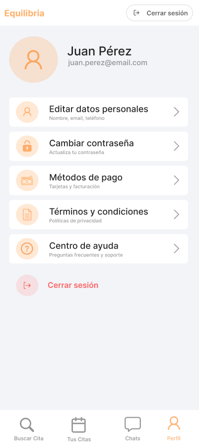

# 2025-1 Programación Móvil - Terapi - Servicios de terapia psicológica en línea

## Descripción de la aplicación móvil

Esta aplicación móvil es una plataforma especializada en brindar servicios de terapia psicológica en línea, orientada a pacientes certificados que buscan atención profesional de manera rápida, segura y personalizada. A través de un sistema de filtros avanzados, los usuarios podrán buscar terapeutas según criterios como especialidad, idioma o enfoque terapéutico, facilitando así una experiencia adaptada a sus necesidades individuales.

El aplicativo permitirá agendar citas virtuales en diferentes modalidades, como sesiones individuales, de pareja, entre otras. También incluirá un sistema de mensajería para dar seguimiento a los procesos terapéuticos, así como perfiles detallados de los profesionales, con reseñas verificadas, tarifas, políticas de cancelación y demás información relevante. Con una interfaz intuitiva y funciones enfocadas en la comodidad del usuario, la plataforma busca convertirse en un espacio confiable y accesible para el cuidado de la salud mental.

---

# Índice

- [2025-1 Programación Móvil - Terapi - Servicios de terapia psicológica en línea](#2025-1-programación-móvil---terapi---servicios-de-terapia-psicológica-en-línea)
  - [Descripción de la aplicación móvil](#descripción-de-la-aplicación-móvil)
- [Índice](#índice)
  - [1. Configuración del Ambiente de Desarrollo](#1-configuración-del-ambiente-de-desarrollo)
    - [1. Visual Studio Code](#1-visual-studio-code)
      - [1.1. Instalación](#11-instalación)
    - [2. Figma](#2-figma)
      - [2.1. Instalación](#21-instalación)
    - [3. pgAdmin](#3-pgadmin)
      - [3.1. Instalación](#31-instalación)
    - [4. Flutter](#4-flutter)
      - [4.1. Instalación](#41-instalación)
    - [5. Android Studio](#5-android-studio)
      - [5.1. Instalación](#51-instalación)
  - [2. Diagrama de Despliegue](#2-diagrama-de-despliegue)
    - [1. Replit](#1-replit)
    - [2. Teléfono Android](#2-teléfono-android)
    - [3. Open Street Server](#3-open-street-server)
  - [3. Requerimientos No Funcionales](#3-requerimientos-no-funcionales)
  - [4. Diagrama de Casos de Uso](#4-diagrama-de-casos-de-uso)
  - [5. Prototipos](#5-prototipos)
    - [Rol](#rol)
    - [Terapeuta - Registro](#terapeuta---registro)
    - [Terapeuta - Registro Info Profesional](#terapeuta---registro-info-profesional)
    - [Terapeuta - Registro Carga de Documentos](#terapeuta---registro-carga-de-documentos)
    - [Terapeuta - Registro Revisión](#terapeuta---registro-revisión)
    - [Terapeuta - Agenda](#terapeuta---agenda)
    - [Terapeuta - Gestión de Horarios](#terapeuta---gestión-de-horarios)
    - [Terapeuta - Cuenta](#terapeuta---cuenta)
    - [Terapeuta - Datos Personales](#terapeuta---datos-personales)
    - [Terapeuta - Información Profesional](#terapeuta---información-profesional)
    - [Terapeuta - Documentos Profesionales](#terapeuta---documentos-profesionales)
    - [Terapeuta - Información Bancaria](#terapeuta---información-bancaria)
    - [Terapeuta - Cambiar Contraseña](#terapeuta---cambiar-contraseña)
    - [Terapeuta - Centro de Ayuda](#terapeuta---centro-de-ayuda)
    - [Terapeuta - Agenda Detalle](#terapeuta---agenda-detalle)
    - [Paciente - Registro](#paciente---registro)
    - [Paciente - Login](#paciente---login)
    - [Paciente - Home Buscar Cita](#paciente---home-buscar-cita)
    - [Paciente - Tus Citas](#paciente---tus-citas)
    - [Paciente - Perfil](#paciente---perfil)
    - [Paciente - Editar Datos Personales](#paciente---editar-datos-personales)
    - [Paciente - Modificar Contraseña](#paciente---modificar-contraseña)
    - [Paciente - Métodos de Pago](#paciente---métodos-de-pago)
    - [Paciente - Agregar Tarjeta](#paciente---agregar-tarjeta)
    - [Paciente - Buscar Cita Filtros](#paciente---buscar-cita-filtros)
    - [Paciente - Buscar Cita Agendar Cita](#paciente---buscar-cita-agendar-cita)
    - [Paciente - Buscar Cita Terapeuta 1](#paciente---buscar-cita-terapeuta-1)
    - [Paciente - Buscar Cita Terapeuta 2](#paciente---buscar-cita-terapeuta-2)
    - [Paciente - Selección de Horarios](#paciente---selección-de-horarios)
    - [Paciente - Detalles de la Cita](#paciente---detalles-de-la-cita)
    - [Paciente - Términos y Condiciones](#paciente---términos-y-condiciones)
    - [Paciente - Centro de Ayuda](#paciente---centro-de-ayuda)

## 1. Configuración del Ambiente de Desarrollo

En esta sección se mencionan las herramientas empleadas en el entorno de desarrollo. Asimismo, se explica el procedimiento de instalación de aquellas herramientas que requirieron descarga. A continuación, se presenta una lista de las herramientas utilizadas, seguida de su respectiva descripción y del procedimiento de instalación, en caso de haber sido necesario.

### 1. Visual Studio Code

> Es un editor de código fuente gratuito y de código abierto desarrollado por Microsoft. Se destaca por su ligereza, alto nivel de personalización y una amplia gama de extensiones que permiten trabajar con múltiples lenguajes de programación. También incluye características como depuración integrada, control de versiones, autocompletado de código y un terminal incorporado, lo que lo convierte en una herramienta apropiada para el desarrollo web y de software.

#### 1.1. Instalación

1. Acceder al sitio web oficial de Visual Studio Code
  - Link: https://code.visualstudio.com/

2. Descargar el archivo instalador del programa
  - Hacer click en el botón “Download” ubicado en la parte superior derecha
  - Seleccionar el sistema operativo correspondiente
  - Visualizar el archivo descargado “VSCodeUserSetup” en la carpeta “Downloads”

3. Ejecutar el instalador y seguir las instrucciones indicadas correspondientes
  - Realizar la configuración de la instalación

4. Instalar extensiones que brinden soporte a lenguajes de programación

### 2. Figma

> Es una herramienta de diseño gráfico y colaboración en tiempo real basada en la web, muy utilizada por equipos de desarrollo de productos digitales. Permite crear interfaces de usuario (UI), prototipos interactivos y realizar diseño vectorial. Su característica más destacada es la capacidad de colaboración, que permite a múltiples diseñadores editar el mismo archivo de forma simultánea.

#### 2.1. Instalación

1. Acceder al sitio web oficial de Figma
  - Link: https://www.figma.com/

2. Registrarse para obtener acceso a la plataforma

3. Iniciar sesión en Figma
  - Nota: No es necesario descargar nada para poder utilizar Figma, es posible emplearlo desde su página web

4. (Opcional) Descargar el archivo instalador del programa
  - Link: https://www.figma.com/downloads/
  - Seleccionar el sistema operativo correspondiente
  - Seleccionar dónde se desea descargar el instalador
  - Visualizar el archivo descargado “FigmaSetup”

5. (Opcional) Ejecutar el instalador y seguir las instrucciones indicadas
  - Realizar la configuración de la instalación

### 3. pgAdmin

> Es una herramienta de administración y desarrollo para bases de datos PostgreSQL. De código abierto, permite gestionar bases de datos de forma visual, ejecutar consultas SQL, crear tablas e índices, así como realizar copias de seguridad. pgAdmin ofrece una interfaz gráfica que facilita la administración de bases de datos PostgreSQL tanto a usuarios principiantes como a administradores experimentados.

#### 3.1. Instalación

1. Acceder al sitio web oficial de pgAdmin
  - Link: https://www.pgadmin.org/

2. Hacer click en el botón “Download”

3. Hacer click en la versión correspondiente al sistema operativo

4. Hacer click en la versión correspondiente a la versión del sistema operativo seleccionado

5. Hacer click en el archivo exe para proceder con la descarga
  - Visualizar que el instalador aparezca en la carpeta “Downloads”

6. Ejecutar el archivo de instalación y seguir las instrucciones indicadas
  - Realizar la configuración de la instalación

### 4. Flutter

> Es un framework de desarrollo de aplicaciones de código abierto creado por Google. Permite construir aplicaciones nativas compiladas para móvil, web y escritorio a partir de una única base de código. Flutter utiliza el lenguaje Dart y destaca por su rendimiento rápido, diseño expresivo y rica colección de widgets personalizables.

#### 4.1. Instalación

1. Acceder al sitio web oficial de Flutter
  - Link: https://flutter.dev/

2. Hacer click en el botón “Get started”

3. Seleccionar el sistema operativo correspondiente (Windows, macOS o Linux)

4. Descargar el archivo comprimido (ZIP para Windows, TAR.XZ para Linux/macOS)

5. Extraer el contenido en una ubicación de fácil acceso (por ejemplo: `C:\src\flutter`)

6. Configurar la variable de entorno `Path`
  - Agregar la ruta del directorio `flutter\bin` a la variable `Path` del sistema

7. Verificar la instalación  
  - Abrir una terminal o consola y ejecutar el comando "flutter doctor"
  - Visualizar el estado de la instalación

### 5. Android Studio

> Es el entorno de desarrollo integrado (IDE) oficial para el desarrollo de aplicaciones Android. Basado en IntelliJ IDEA, proporciona herramientas poderosas para el diseño, edición de código, depuración y prueba de aplicaciones móviles, además de emuladores de dispositivos y gestión de SDKs.

#### 5.1. Instalación

1. Acceder al sitio web oficial de Android Studio  
  - Link: https://developer.android.com/studio

2. Hacer click en el botón “Download Android Studio”

3. Aceptar los términos y condiciones de uso

4. Descargar el archivo de instalación correspondiente al sistema operativo

5. Ejecutar el archivo descargado para iniciar el asistente de instalación

6. Seguir las instrucciones del instalador
  - Seleccionar los componentes recomendados (Android Studio, Android SDK, Android Virtual Device)

7. Verificar la instalación  
  - Abrir Android Studio y completar la configuración inicial
  - Visualizar que el IDE funcione correctamente y que esté listo para crear o importar proyectos

## 2. Diagrama de Despliegue

### 1. Replit
Es una plataforma en la nube para desarrollar y alojar aplicaciones, donde se trabajara con la base de datos de Postgres y también con el lenguaje de programación de TypeScript.

### 2. Teléfono Android
Dispositivo móvil que ejecuta la app del usuario en la cual se llama “Therapy”

### 3. Open Street Server
Servidor que proporciona servicios de mapas mediante una API REST.

*<b>Figura 1:</b> Diagrama de despliegue*

## 3. Requerimientos No Funcionales

| ID    | Requerimiento no funcional         | Descripción                                                                |
|-------|------------------------------------|----------------------------------------------------------------------------|
| RNF 1 | Encriptación de datos              | Cifrar datos sensibles (contraseñas y pagos).                              |
| RNF 2 | Cumplimiento de normativas         | Ley de Protección de Datos Personales (Ley N° 29733) y su reglamento.      |
| RNF 3 | Tiempo de respuesta                | Máximo 2 segundos para cargar perfiles, chats y agendas.                   |
| RNF 4 | Disponibilidad                     | 99.9% de uptime, con mantenimiento programado en horarios no críticos.     |
| RNF 5 | Accesibilidad                      | Compatibilidad con lectores de pantalla y diseño responsive.               |
| RNF 6 | Interfaz intuitiva                 | 90% de usuarios completan una cita en menos de 5 pasos.                    |
| RNF 7 | Backup de datos                    | Copias de seguridad diarias y recuperación ante desastres en 24 horas.     |
| RNF 8 | Política de cancelación automática | Cancelaciones hasta 24h antes deben reflejarse al instante en el sistema.  |
| RNF 9 | Compatibilidad multiplataforma     | Funcionamiento en iOS y Android.                                           |
| RNF 10| Integración con pasarelas de pago  | Facilidad de pago con diferentes métodos y seguridad vía (Stripe).         |
| RNF 11| Gestión de consentimiento          | Los usuarios deben aceptar explícitamente el uso de sus datos terapéuticos.|

## 4. Diagrama de Casos de Uso

*<b>Figura 2:</b> Diagrama de casos de uso*

A continuación se detallan los requerimientos funcionales:

| Nº   | Requerimiento Funcional            | Descripción                                                                                                    |
|------|------------------------------------|----------------------------------------------------------------------------------------------------------------|
| RF1  | Inicio de Sesión                   | Permitir que los usuarios registrados ingresen al sistema mediante su correo y contraseña.                     |
| RF2  | Registro                           | Permitir a nuevos usuarios crear una cuenta con sus datos personales.                                          |
| RF3  | Búsqueda de terapeutas             | Permitir a los pacientes encontrar terapeutas disponibles en la plataforma.                                    |
| RF4  | Aplicación de filtros              | Permitir a los pacientes aplicar filtros a su búsqueda de terapeutas, como especialidad, idioma o país.        |
| RF5  | Agendamiento de citas              | Permitir a los pacientes programar citas virtuales seleccionando fecha, hora y terapeuta.                      |
| RF6  | Cancelación de citas               | Permitir a los pacientes cancelar citas previamente agendadas respetando políticas de cancelación.             |
| RF7  | Mensajería                         | Permitir la comunicación entre pacientes y terapeutas mediante un chat interno dentro de la aplicación.        |
| RF8  | Calificación y reseñas             | Permitir a los pacientes calificar a los terapeutas después de una sesión mediante comentarios y puntuación.   |
| RF9  | Notificación programada            | Enviar alertas automáticas a pacientes y terapeutas sobre recordatorios de citas y nuevos mensajes.            |
| RF10 | Gestión de perfil profesional      | Permitir a los terapeutas actualizar su información profesional, como especializaciones, experiencia y precio. |
| RF11 | Aceptar o cancelar citas           | Permitir a los terapeutas aceptar o cancelar solicitudes de citas agendadas por los pacientes.                 |
| RF12 | Gestionar cuentas de usuario       | Permitir al administrador crear, editar, desactivar o eliminar cuentas de pacientes y terapeutas.              |

Y el diagrama de clases es el siguiente:

*<b>Figura 3:</b> Diagrama de clases*

## 5. Prototipos

En función a los casos de uso se proponen los siguientes prototipos:

### Rol

### Terapeuta - Registro

### Terapeuta - Registro Info Profesional

### Terapeuta - Registro Carga de Documentos

### Terapeuta - Registro Revisión

### Terapeuta - Agenda

### Terapeuta - Gestión de Horarios

### Terapeuta - Cuenta

### Terapeuta - Datos Personales

### Terapeuta - Información Profesional

### Terapeuta - Documentos Profesionales

### Terapeuta - Información Bancaria

### Terapeuta - Cambiar Contraseña

### Terapeuta - Centro de Ayuda

### Terapeuta - Agenda Detalle

### Paciente - Registro

### Paciente - Login

### Paciente - Home Buscar Cita

### Paciente - Tus Citas

### Paciente - Perfil

### Paciente - Editar Datos Personales

### Paciente - Modificar Contraseña

### Paciente - Métodos de Pago

### Paciente - Agregar Tarjeta

### Paciente - Buscar Cita Filtros

### Paciente - Buscar Cita Agendar Cita

### Paciente - Buscar Cita Terapeuta 1

### Paciente - Buscar Cita Terapeuta 2

### Paciente - Selección de Horarios

### Paciente - Detalles de la Cita

### Paciente - Términos y Condiciones

### Paciente - Centro de Ayuda

